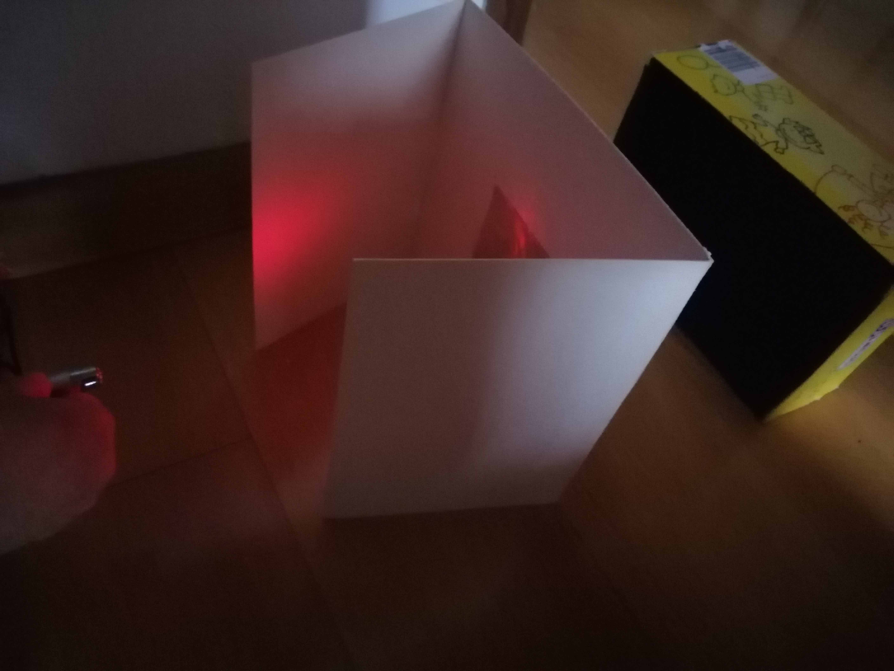
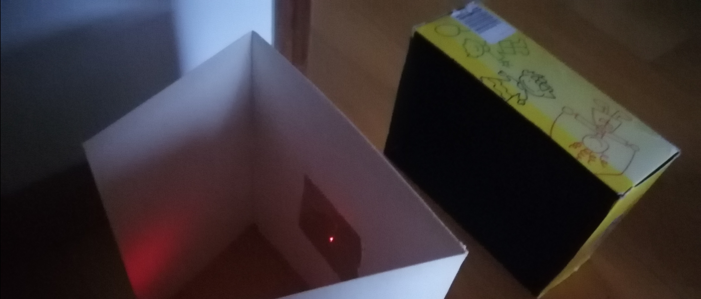
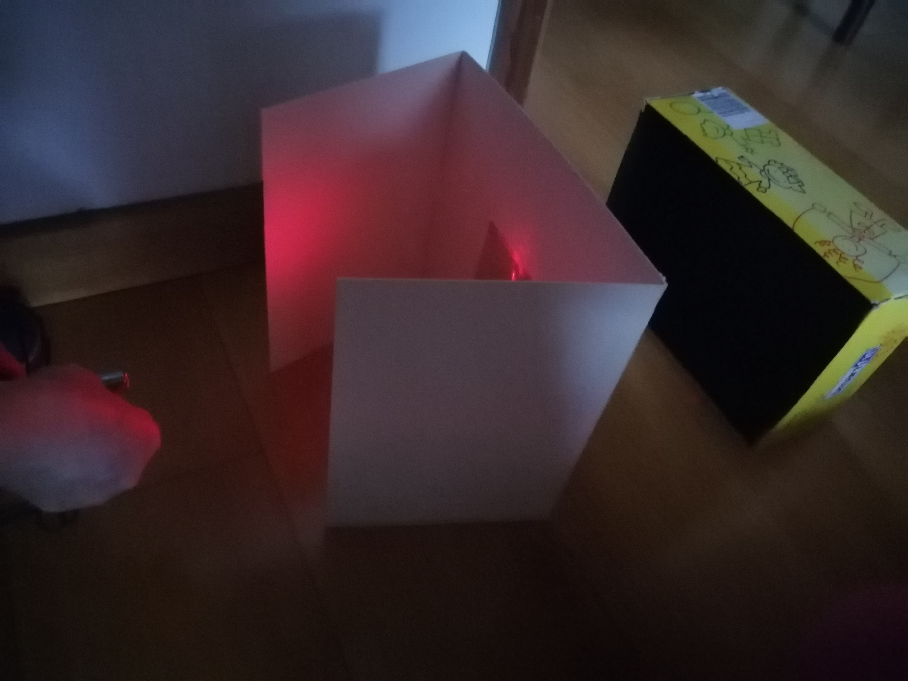
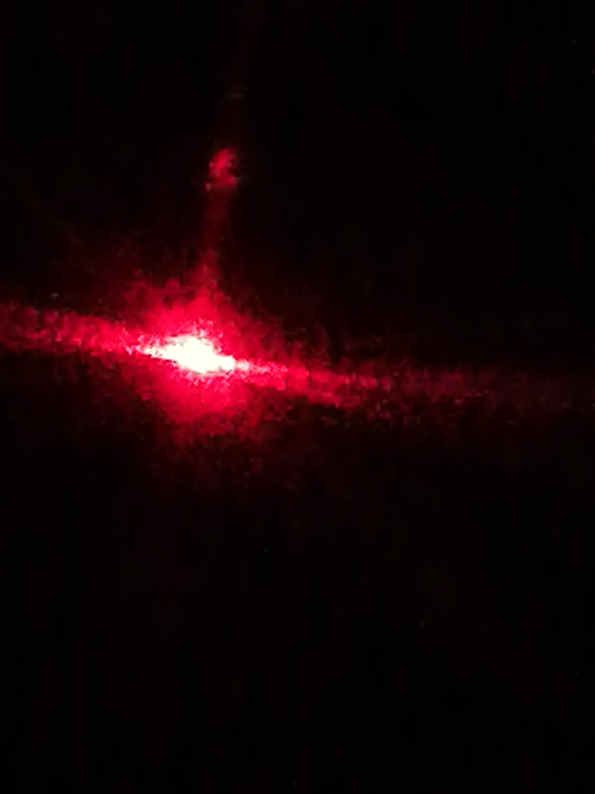
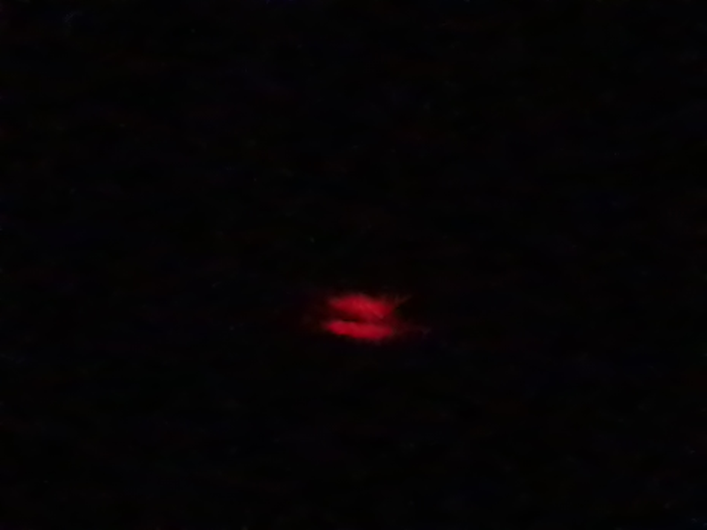
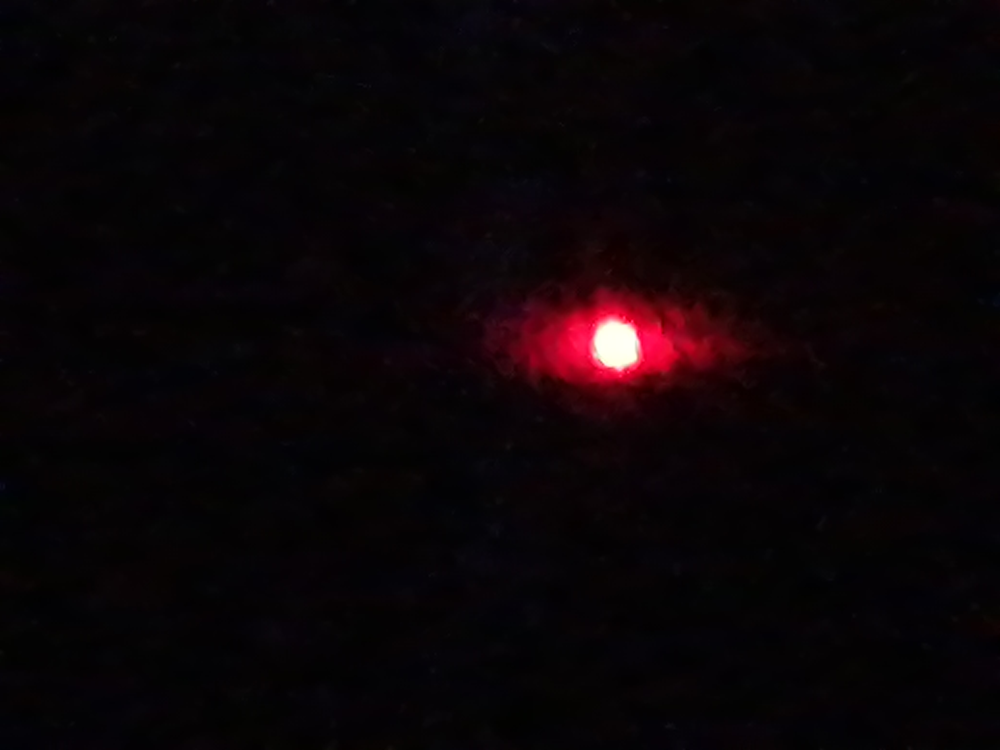
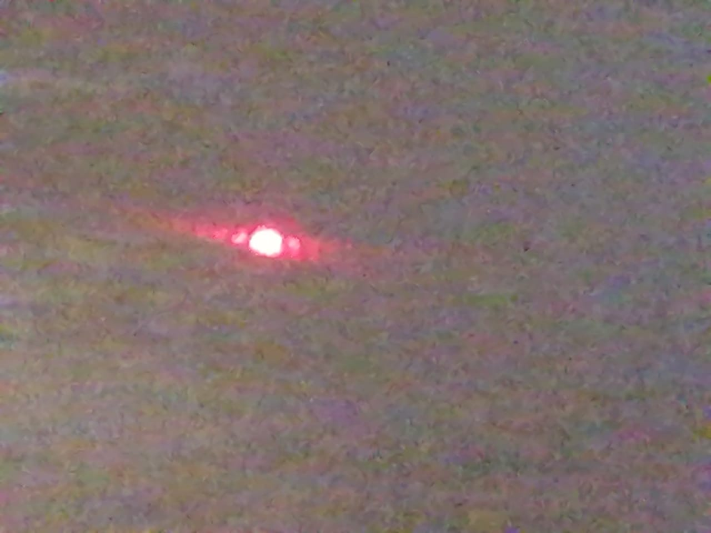
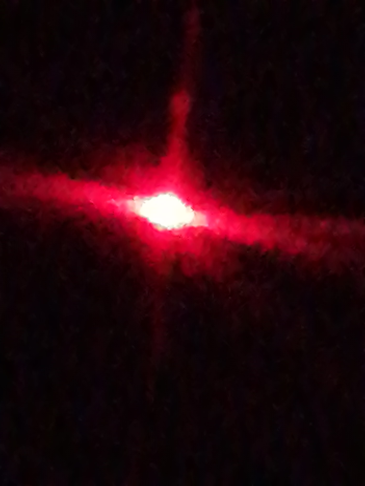

# Competencia De La Doble Rendija

_El experimento de la doble rendija, también conocido como el experimento de Young, fue realizado por el científico ingles Thomas Young en 1801 cuyo objetivo era demostrar el comportamiento de la luz, pero termino creando una nueva teoría relacionada con la física cuántica.
Este experimento es una demostración del fenómeno cuántico conocido como interferencia. Hay que tener mucho cuidado con esta palabra ya que ha sido tema de debate dentro de la comunidad científica debido a que mientras unos creen en que esta interferencia es generada entre las ondas creadas a partir de la onda original al pasar por las rendijas mientras otros creen que esta interferencia es producto del choque del mismo fotón en múltiples universos; esta es la explicación que más nos convence._

## Montaje

Para realizar el montaje físico se necesitan los siguientes materiales:

* Papel aluminio 

* Cartón paja

* Puntero láser

* Bisturí

* Pegamento

* Caja de zapatos (opcional)

* Pintura negra (opcional)

* Pincel (opcional)

Para armar el experimento, primero se deben hacer las dos rendijas en un rectángulo de papel aluminio con el bisturí; **esta es la parte más importante ya que deben estar, las rendijas, lo más cerca posible**. Después de tener las rendijas listas, se recorta en el cartón paja de tal forma que este sirva como soporte. A este cartón paja se le pegan dos más para que así la rendija se sostenga sola y no este tan cerca del piso, permitiendo que sea más fácil el uso del láser. Para que sea más fácil ver el patrón de interferencia, se pinta una caja de zapatos con negro, sin embargo, este paso esta a criterio de cada persona implementarlo a su proyecto o no. Para finalizar se crea o busca, como en este caso, un soporte para poner el láser permitiendo una fácil manipulación del mismo y se enciende para que la luz pase por alguna de las dos rendijas (sin estar seguros de por cual paso) y termine en la caja de zapatos. Así quedo el montaje:







## Resultados








## Explicación

Para explicar los resultados obtenidos en este experimento primero debemos representarlo en una matriz.


En este experimento es vital el uso de imaginarios ya que gracias a ellos podemos presenciar algebraicamente el fenómeno de interferencia. 

Después de dos clics la matriz quedo de la siguiente forma:


Tengan en mente el vector de estado:


Ahora hablemos de la probabilidad, como los números complejos no pueden representar probabilidades entonces debemos modificar la matriz inicial obteniendo el modulo al cuadrado de cada elemento dejando el siguiente resultado:


Esta matriz muestra las probabilidades del experimento. Ya que al existir dos rendijas tienen un 50% de probabilidad de pasar por alguna de las dos, pero no sabemos por cuál de los dos pasos, mientras que al considerar que cada receptor cuenta con 3 detectores siendo este representado con el 1/3. Ya el resto de detectores tiene el 100% de probabilidad de que el fotón se quede ahí.

Después de dos clics esta matriz queda de la siguiente forma:


Ahora al sacar el módulo al cuadrado del primer vector de estado y comparar ambos vectores, notamos una única diferencia:


En la posición 5 el primer vector de estado hay un 0 mientras que en el otro vector tiene 1/3, viéndose de **forma algebraica el fenómeno de interferencia**.

## Simulador

Como se mostró con anterioridad, este experimento se puede mostrar de forma algebraica por lo que se puede programar. El simulador consta de la **parte cuántica y probabilística**, ambas se pueden ver de forma grafica mediante un **diagrama de barras**. Esta predeterminado para calcular la **matriz con dos rendijas, cada una con tres blancos, después de 1, 2 y 3 clics**.

## Como funciona

Para el correcto uso del simulador se tiene que descargar obligatoriamente todos los archivos .py que se encuentran dentro de este repositorio, a excepción de clasicoACuanticoTest.py ya que este solo es la prueba de que el programa clasicoACuantico.py funciona correctamente. Para usar el simulador se tiene que invocar quantumSimulator() o probabilisticSimulator(), dependiendo de lo que necesite.

### Como son las salidas:

Matrices: [[(R, I), (R, I)], [(R, I), (R, I)], ...]

Vectores: [(R, I), (R, I), (R, I), (R, I), ...]

**Siendo I y R la representación imaginaria y real de un número complejo respectivamente. El vector de quantumSimulador() se muestra con su parte imaginaria pero al graficarlo estará operada con módulo al cuadrado.**

#### Ejemplos de entradas siguiendo el orden de la explicación previa:
```
[[(5, 6), (20, -2)], [(10, -4.2), (27, -12)]]
[(6,-4),(7,3),(4.2,-8.1),(0,-3)]
```

## Pre-requisitos

Para asegurar el funciinamiento del simulador se recomienda tener instalado python en su computador; preferiblemente la versión 3.9. Además se debe tener instalada la libreria matplot para poder mostrar los diagramas.

## Built with

Pycharm Community Editor 2020.3.2

## Versiones

Hasta la fecha hay 1 versión disponible.

## Autores

María José Torres Nieves - Estudiante ingenieria de sistemas.
